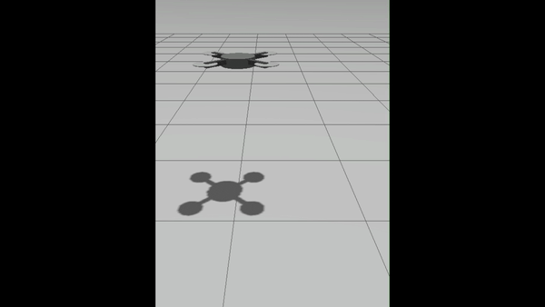

# ros2_quadrotor

PPO-trained hover control for a quadrotor in **Gazebo Sim**, wired through **ROS 2 Jazzy** and **ros_gz_bridge**.



Full clip: [v0.1.0 release](https://github.com/franciscodngferreira/ros2_quadrotor/releases/tag/v0.1.0).

## Stack

Gazebo Sim → `ros_gz_bridge` → `QuadrotorHoverEnv` (Gymnasium) → PPO (`train_hover.py`).

## Prerequisites

- ROS 2 Jazzy, Gazebo Sim, `ros_gz_sim`, `ros_gz_bridge`, `colcon`
- Python venv with `gymnasium`, `stable-baselines3`, `torch` (venv should see `rclpy` after sourcing ROS — e.g. `python3 -m venv --system-site-packages ~/rl_venv`)

```bash
sudo apt install ros-jazzy-ros-gz-sim ros-jazzy-ros-gz-bridge python3-colcon-common-extensions
```

## Build

```bash
cd ~/ros2_ws
source /opt/ros/jazzy/setup.bash
colcon build --packages-select quadrotor_sim --symlink-install
source install/setup.bash
```

## Run demo (GUI + policy)

**Terminal 1** — sim with GUI (wait ~5 s for spawn):

```bash
source /opt/ros/jazzy/setup.bash && source install/setup.bash
ros2 launch quadrotor_sim quadrotor_gui.launch.py
```

**Terminal 2** — run trained policy (train first, or use your own `quadrotor_hover_ppo.zip`):

```bash
source ~/rl_venv/bin/activate
source /opt/ros/jazzy/setup.bash && source install/setup.bash
cd ~/ros2_ws
python3 scripts/eval_hover.py --episodes 3
```

Longer recording: `python3 scripts/eval_hover.py --max-steps 2000 --episodes 1`

Do **not** run `train_hover.py` while the launch above is running (duplicate Gazebo/bridge).

## Train

Starts its own headless Gazebo, bridge, and spawn:

```bash
source ~/rl_venv/bin/activate
source /opt/ros/jazzy/setup.bash && source install/setup.bash
cd ~/ros2_ws
python3 src/quadrotor_sim/quadrotor_sim/train/train_hover.py
```

Writes `quadrotor_hover_ppo.zip` and `hover_tensorboard/` (gitignored). TensorBoard: `tensorboard --logdir hover_tensorboard`.

## Headless sim only

```bash
ros2 launch quadrotor_sim quadrotor.launch.py
```

## Layout

| Path | What |
|------|------|
| `src/quadrotor_sim/` | ROS package (model, launch, env, train) |
| `scripts/eval_hover.py` | Evaluate policy against a live sim |
| `scripts/check_env_smoke.py` | Gymnasium `check_env` smoke test |

## Topics

| ROS topic | Type |
|-----------|------|
| `/quadrotor/cmd_vel` | `geometry_msgs/Twist` |
| `/quadrotor/enable` | `std_msgs/Bool` |
| `/quadrotor/odom` | `nav_msgs/Odometry` |
| `/quadrotor/imu` | `sensor_msgs/Imu` |

## Troubleshooting

- **No odom/imu** — bridge or spawn not up; check `ros2 topic list`.
- **`rclpy` / SB3 missing** — source ROS + `install/setup.bash`; activate RL venv.
- **Drone invisible in GUI** — use `quadrotor_gui.launch.py` (split `-s` server + `-g` client), not headless launch alone.
- **Training vs launch conflict** — only one of `train_hover.py` or `ros2 launch` at a time.

## License

See `src/quadrotor_sim/package.xml`.
