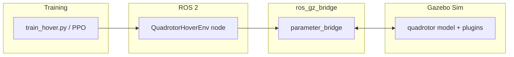

# quadrotor_sim

ROS 2 workspace that runs a quadrotor in **Gazebo Sim (gz-sim)**, bridges selected topics through **ros_gz_bridge**, and trains a hover policy with **Gymnasium** + **Stable-Baselines3 (PPO)**.

## Contents

- [Overview](#overview)
- [Repository layout](#repository-layout)
- [Prerequisites](#prerequisites)
- [Quick start](#quick-start)
- [Build](#build)
- [Run the simulator](#run-the-simulator)
- [Train (PPO)](#train-ppo)
- [Optional: smoke test](#optional-smoke-test)
- [ROS ↔ Gazebo interface](#ros--gazebo-interface)
- [Architecture](#architecture)
- [Configuration and debugging](#configuration-and-debugging)
- [Outputs and git hygiene](#outputs-and-git-hygiene)
- [Troubleshooting](#troubleshooting)
- [Known limitations](#known-limitations)

---

## Overview

| Layer | What it does |
|--------|----------------|
| **Gazebo Sim** | Physics, multicopter plugin, IMU / odometry sensors on the `quadrotor` model. |
| **ros_gz_bridge** | Maps named ROS 2 topics to gz transport (and back). |
| **ROS 2 (`rclpy`)** | `QuadrotorHoverEnv` is a small ROS node inside a Gymnasium `Env`: publishes commands, subscribes to state. |
| **Stable-Baselines3** | PPO training loop in `train_hover.py`. |

There are two ways to start the sim stack:

1. **`ros2 launch quadrotor_sim quadrotor.launch.py`** — default `gz_args` use **`-s`** (server only / no Gazebo GUI) and **`-r`** (start simulation running). Pass **`gz_args:=...`** on the command line to change flags (`gz sim --help`: `-s`, `-r`, `-g`, …).
2. **`train_hover.py`** — spawns `gz sim`, the bridge, and `ros_gz_sim create` itself; **do not** run this at the same time as (1) on the same topics, or you will get duplicate bridges / conflicting processes.

---

## Repository layout

Workspace root (typical ROS 2 + colcon layout):

| Path | Purpose |
|------|---------|
| `src/` | Package sources (what you edit and version-control). |
| `build/` | colcon CMake/Python build trees (generated; ignored by git). |
| `install/` | Installed artifacts; **`source install/setup.bash`** before running ROS commands. |
| `log/` | colcon and ROS log output (generated; ignored by git). |
| `scripts/` | Helper scripts (e.g. env smoke test). |

### Package: `quadrotor_sim`

| Path | Role |
|------|------|
| `package.xml` | Package metadata and dependencies (`rclpy`, message packages, `ros_gz_sim`, `ros_gz_bridge`, …). |
| `CMakeLists.txt` | **ament_cmake**: installs `models/`, `worlds/`, `launch/` into `share/quadrotor_sim`, and installs the Python package via `ament_python_install_package`. |
| `launch/quadrotor.launch.py` | Starts gz-sim with `worlds/empty.sdf`, spawns `models/quadrotor/quadrotor.sdf`, runs `parameter_bridge`. |
| `worlds/empty.sdf` | Minimal world (name `empty` — used by gz services such as `/world/empty/control`). |
| `models/quadrotor/` | SDF (and optional xacro) for the quadrotor and plugins. |
| `quadrotor_sim/envs/quadrotor_hover_env.py` | Gymnasium environment (ROS publishers/subscribers + reward/reset logic). |
| `quadrotor_sim/train/train_hover.py` | End-to-end training: cleans up old gz processes, launches sim + bridge + spawn, then PPO. |

---

## Prerequisites

- **ROS 2 Jazzy** (paths below assume `/opt/ros/jazzy`).
- **Gazebo Sim** and ROS–Gazebo integration packages, including at least:
  - `ros_gz_sim`
  - `ros_gz_bridge`
- **colcon** (usually installed with ROS build tools).
- **Python** (3.x as required by Jazzy) with a virtualenv or system packages for:
  - `gymnasium`
  - `stable-baselines3`
  - `numpy`
  - `torch` (or another backend SB3 can use)
  - Same environment must be able to import `rclpy` and message packages once the workspace overlay is sourced (typically use a venv that was created **after** sourcing ROS, or use `venv --system-site-packages` so ROS Python packages are visible—pick the workflow that matches your machine).

Ubuntu example for ROS + Gazebo packages (names may vary slightly by distro):

```bash
sudo apt update
sudo apt install ros-jazzy-ros-gz-sim ros-jazzy-ros-gz-bridge python3-colcon-common-extensions
```

---

## Quick start

From the workspace root (`~/ros2_ws` or your clone):

```bash
cd ~/ros2_ws
source /opt/ros/jazzy/setup.bash
colcon build --packages-select quadrotor_sim --symlink-install
source install/setup.bash
ros2 launch quadrotor_sim quadrotor.launch.py
```

For training, also activate the Python environment that has SB3/Gymnasium, then run the training script (see [Train (PPO)](#train-ppo)).

---

## Build

```bash
source /opt/ros/jazzy/setup.bash
cd ~/ros2_ws
colcon build --packages-select quadrotor_sim --symlink-install
source install/setup.bash
```

`--symlink-install` keeps Python edits under `src/` visible without reinstalling (recommended for development).

---

## Run the simulator

Ensure the overlay is sourced:

```bash
cd ~/ros2_ws
source /opt/ros/jazzy/setup.bash
source install/setup.bash
ros2 launch quadrotor_sim quadrotor.launch.py
```

The launch file includes upstream `ros_gz_sim`’s `gz_sim.launch.py` and passes **`gz_args`** (by default **`-s -r`** plus the world path): headless server and simulation running on start. Change **`gz_args`** when launching if you need different `gz sim` behavior.

**Sanity check** (in another terminal, with the same `source` lines):

```bash
ros2 topic echo --once /quadrotor/imu
ros2 topic echo --once /quadrotor/odom
ros2 topic pub --once /quadrotor/enable std_msgs/msg/Bool "{data: true}"
```

---

## Train (PPO)

`train_hover.py` **kills existing** `gz sim` / `ros2 launch` / `parameter_bridge` processes, then starts its own headless gz, bridge, and spawn pipeline. Run it from the **workspace root** with the ROS overlay and your RL dependencies available.

**Example session** (adjust venv path and distro):

```bash
cd ~/ros2_ws
source ~/rl_venv/bin/activate   # gymnasium, stable-baselines3, torch, …

# Optional: keep ROS/Gazebo state under the workspace instead of ~/.ros / ~/.gz
export ROS_HOME=$PWD/.ros_run
export ROS_LOG_DIR=$PWD/log/ros_run
export GZ_HOME=$PWD/.gz_run
mkdir -p "$ROS_HOME" "$ROS_LOG_DIR" "$GZ_HOME"

source /opt/ros/jazzy/setup.bash
source install/setup.bash

export QUADROTOR_ENV_DEBUG_RX=0   # set to 1 for extra receive-side prints in the env
python3 -u src/quadrotor_sim/quadrotor_sim/train/train_hover.py
```

Notes:

- The script prepends the package source tree to `sys.path` so you iterate on `src/quadrotor_sim` without reinstalling; you still need **`source install/setup.bash`** so `ros2`, `gz`, and message packages resolve correctly.
- `main()` calls `_ensure_runtime_dirs()` which defaults `ROS_HOME` / `ROS_LOG_DIR` / `GZ_HOME` under the current working directory if unset (see `train_hover.py` and `quadrotor_hover_env.py`).
- Hyperparameters and timestep count are defined in `train_hover.py` (`PPO(...)`, `model.learn(...)`).

**TensorBoard** (from workspace root, while or after training):

```bash
tensorboard --logdir hover_tensorboard
```

Artifacts (by default next to the cwd):

| Output | Description |
|--------|-------------|
| `hover_tensorboard/` | SB3 TensorBoard logs. |
| `quadrotor_hover_ppo.zip` | Saved policy (SB3 format). |

---

## Optional: smoke test

`scripts/check_env_smoke.py` launches `quadrotor_sim` via `ros2 launch`, waits, constructs `QuadrotorHoverEnv`, and runs Gymnasium’s `check_env`. Requires the same ROS + Python deps as training. Example:

```bash
cd ~/ros2_ws
source /opt/ros/jazzy/setup.bash
source install/setup.bash
source ~/rl_venv/bin/activate
python3 scripts/check_env_smoke.py
```

---

## ROS ↔ Gazebo interface

Bridged topic pairs (ROS name → gz type) match `launch/quadrotor.launch.py` and the subprocess bridge in `train_hover.py`:

| Direction | ROS topic | ROS type |
|-----------|-----------|----------|
| ROS → Gz | `/quadrotor/cmd_vel` | `geometry_msgs/msg/Twist` |
| ROS → Gz | `/quadrotor/enable` | `std_msgs/msg/Bool` |
| Gz → ROS | `/quadrotor/imu` | `sensor_msgs/msg/Imu` |
| Gz → ROS | `/quadrotor/odom` | `nav_msgs/msg/Odometry` |

The Gym environment publishes **Twist** + **Bool**, subscribes to **Odometry** + **Imu**, and uses gz **services** for pause / unpause / pose reset (`/world/empty/...`).

---

## Architecture



---

## Configuration and debugging

| Variable | Effect |
|----------|--------|
| `QUADROTOR_ENV_DEBUG_RX` | If `1` / `true` / `yes` / `on`, prints when first odom/IMU messages arrive (`quadrotor_hover_env.py`). |
| `ROS_HOME`, `ROS_LOG_DIR` | Where ROS stores durable state and log files. |
| `GZ_HOME` | Gazebo user config/cache location for this shell/session. |

---

## Outputs and git hygiene

The provided `.gitignore` excludes colcon directories (`build/`, `install/`, `log/`), local ROS/Gazebo dirs, TensorBoard runs, the default PPO zip name, and Python caches. **Rebuild after clone:**

```bash
colcon build --symlink-install && source install/setup.bash
```

---

## Troubleshooting

| Symptom | Things to check |
|---------|------------------|
| `ros2: command not found` / missing msgs | Source `/opt/ros/jazzy/setup.bash` **and** `install/setup.bash`. |
| `ModuleNotFoundError: rclpy` | Python env cannot see ROS packages; use `--system-site-packages` venv or install/use the system Python that matches Jazzy, or extend `PYTHONPATH` deliberately (fragile). |
| No `/quadrotor/odom` | Bridge not running, spawn failed, or wrong cwd/env; confirm `ros2 topic list` and gz is up. |
| Training hangs on “Waiting for Gazebo” | Port/world conflict; the training script runs `pkill`—close other gz sessions or reboot stale daemons. |
| Permission errors under `~/.ros` | Set `ROS_HOME` / `ROS_LOG_DIR` to a writable directory (see [Train (PPO)](#train-ppo)). |
| Stale Python code | With `--symlink-install`, Python under `install/` is linked to `src/`; without it, rebuild after edits. |

---

## Known limitations

- `package.xml` still has placeholder maintainer/license text.
- Reset path in the env favors **teleport + pause** (`set_pose` / `WorldControl`) rather than full delete+respawn for speed and stability; see `quadrotor_hover_env.py` for details.

---

## License

See `src/quadrotor_sim/package.xml`; replace `TODO` with your chosen license before publishing.
